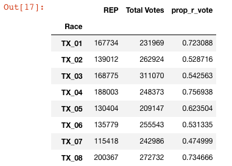
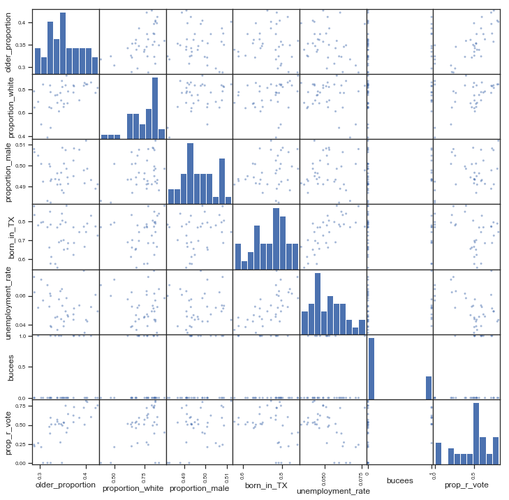
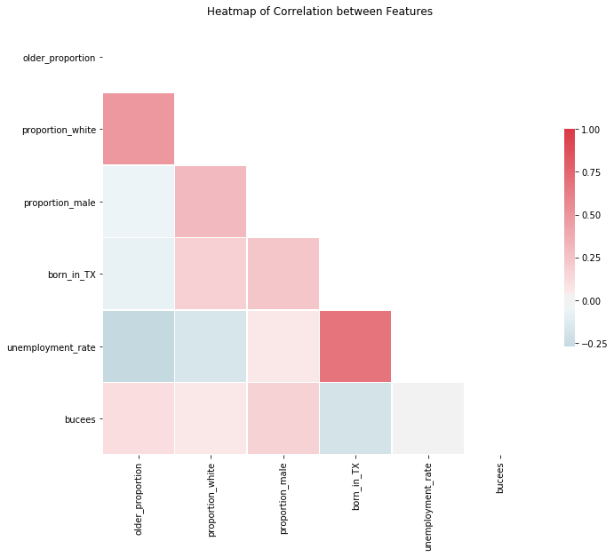
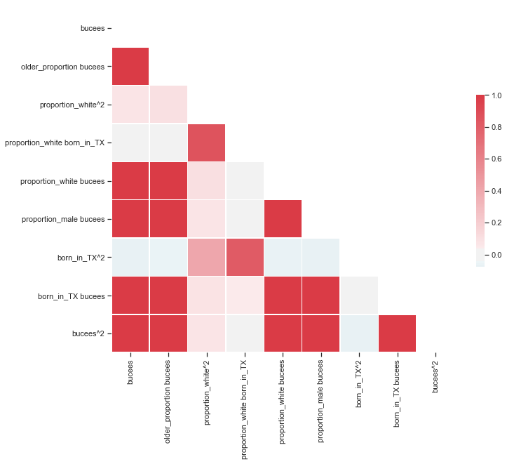

# Texas Voter Analysis

**Prediction**: We are trying to predict how a Texas district will vote given its population data.

**Thesis**: Showing how district demographic features determine what share of the district votes Republican.

## Dependent Variable: Proportion of Republican voters in each congressional district
To obtain our dependent variable, we used **requests.get** and **pandas.read_html** on the election result pages of the **2018 Midterm Elections** from the Texas Secretary of State's website. <br />
<br />
We cleaned and exported the raw html into a CSV for each race. We were then able to loop through the CSVs to extract the exact data we needed: **Repulican vote count** and **total votes**.


```python
races_list = list(range(0,38))
def tx_race_csv_creator(num_list):
    for race_num in num_list:
        if race_num > 0 and race_num < 37:
            pull = requests.get('https://enrpages.sos.state.tx.us/public/nov06_331_race'+str(race_num)+'.htm')
            df_raw = pd.read_html(pull.text)[0]
            if len(df_raw.columns) == 7:
                df_raw.columns = column_header_lib
            elif len(df_raw.columns) == 6:
                df_raw.columns = column_header_no_lib
            elif len(df_raw.columns) == 8:
                df_raw.columns = column_header_lib_ind
            else:
                return print("ERROR! Invalid Column Header")
            df_remove_early = df_raw[df_raw["County"]!="Early"]
            df = df_remove_early.drop(df_remove_early.index[0:3])
            df.to_csv('/Users/jim_jack/Documents/mod_2_project/mod_2_project_ds102218/results_csvs/TX_'+str(race_num)+'.csv')
        elif race_num == 0:
            pull = requests.get('https://enrpages.sos.state.tx.us/public/nov06_331_race'+str(race_num)+'.htm')
            df_raw = pd.read_html(pull.text)[0]
            df_raw.columns = column_header
            df_remove_early = df_raw[df_raw["County"]!="Early"]
            df = df_remove_early.drop(df_remove_early.index[0:3])
            df.to_csv('/Users/jim_jack/Documents/mod_2_project/mod_2_project_ds102218/results_csvs/US_Sen.csv')
        else:
            pull = requests.get('https://enrpages.sos.state.tx.us/public/nov06_331_race'+str(race_num)+'.htm')
            df_raw = pd.read_html(pull.text)[0]
            df_raw.columns = column_header
            df_remove_early = df_raw[df_raw["County"]!="Early"]
            df = df_remove_early.drop(df_remove_early.index[0:3])
            df.to_csv('/Users/jim_jack/Documents/mod_2_project/mod_2_project_ds102218/results_csvs/TX_Gov.csv')
        print("Created csv for Race Number: "+str(race_num))
        if race_num == num_list[-1]:
            print("All Results Data Updated")
```

We took the extracted data and put it into its own Pandas dataframe and calculated the share of Republican votes for the senate, gubernatorial and each congressional election.


```python
def create_summary_df():
    path = '/Users/jim_jack/Documents/mod_2_project/mod_2_project_ds102218/results_csvs'
    allFiles = glob.glob(path + "/*.csv")
    df_summary = []
    for data in allFiles:
        df_dict = {}
        local_df = pd.read_csv(data)
        df_dict['Race'] = file_name_finder(data)
        if "REP" in local_df.columns:
            df_dict['REP'] = local_df.iloc[0]["REP"]
        else:
            df_dict["REP"] = 0
        df_dict['Total Votes'] = local_df.iloc[0]["Total Votes"]
        df_summary.append(df_dict)
    return pd.DataFrame(df_summary)
```



## Independent Variables

For our study, we thought about what metrics would lead to a particular district vote Republican.
* Proportion of district that is of the baby-boomer generation and older
    * The baby-boomer generation is defined (on Wikipedia) as people born in the year **1964 and later**. Since the raw data given gives us the number of people in each age group, we took the age group *45 to 54* and multiplied that by 0.2, as a fifth of the people in that group would be considered 'baby boomers' in the year 2017
    * We also took this proportion out of people aged **18 and up**, because we wanted to only look at people eligible to vote
* Proportion of the district that is White
* Proportion of the district that is male
* Proportion of the district that was born in Texas
    * We took this proportion out of the number of people in the district that were born in the United States
* Mean income
* Education attainment
    * We looked at the proportion of the district that achieved an education **past high school** -- including Associate's degrees, Bachelor's degrees, and higher
* Unemployment rate
* Buc-ee's: our categorical variable

We have a function for each new column!
(with the exception of mean income, that we pull directly from the cleaned table)


```python
def babyboomers(row):
    teens = [int(row['15 to 19 years'])*0.4]
    youngbbbs = [int(row['45 to 54 years'])*0.2]
    agegroups = ['20 to 24 years','25 to 34 years','35 to 44 years','45 to 54 years','55 to 59 years',
                 '60 to 64 years','65 to 74 years','75 to 84 years','85 years and over']
    popn = sum(teens + list(map(lambda a: int(row[a]), agegroups)))
    age_groups = ['55 to 59 years', '60 to 64 years','65 to 74 years','75 to 84 years','85 years and over']
    return sum(youngbbbs + list(map(lambda a: int(row[a]), age_groups)))/popn

def prop_white(row):
    return int(row['White'])/int(row['Total population'].head(1))

def prop_male(row):
    return int(row['Male'])/int(row['Total population'].head(1))

def texas_born(row):
    return int(row['State of residence'])/int(row['Born in United States'])

def higheredu(row):
    return (int(row["Associate's degree"])+int(row["Bachelor's degree"])+ \
            int(row["Graduate or professional degree"]))/int(row["Population 25 years and over"])

def unemployment(row):
    return int(row['Unemployed'])/int(row['Civilian labor force'].head(1))
```


```python
import pandas as pd
import numpy as np
texas_raw = pd.read_csv('Texas_District_all.csv')
texas_raw.head() 
labelled = texas_raw.set_index('Title') # setting the index to the metric measured
table_headers = list(map(lambda x: 'District 0'+str(x)+' Estimate', range(1, 10))) + \
                list(map(lambda x: 'District '+str(x)+' Estimate', range(10, 37))) # new headers
cleaned = labelled.loc[:, table_headers].transpose().dropna(axis=1) # dropping the NaN columns
df = pd.DataFrame(index = cleaned.index) 

```


```python
# scraping for districts with Buc-ee's

from bs4 import BeautifulSoup
import requests
import re
url = 'https://www.buc-ees.com/locations.php'
html = requests.get(url)
soup = BeautifulSoup(html.content, 'html.parser')
locationsoup = soup.findAll({'div': 'container'})[13:40]
loc = []
for location in locationsoup:
    loc += location.findAll('p')[-1].contents
addresses = list(filter(lambda l: 'TX' in l, loc))
```


```python
districts = [22, 14, 10, 36, 14, 10, 26, 10, 27, 26, 14, 10, 27, 10, 14, 22, 27, 8, 35, 22, 27, 22, 31, 5, 14, 10, 27]
list(sorted(set(districts)))
```


    [5, 8, 10, 14, 22, 26, 27, 31, 35, 36]


```python
# adding columns into our new dataframe!

df['older_proportion'] = cleaned.apply(lambda row: babyboomers(row),axis=1)
df['proportion_white'] = cleaned.apply(lambda row: prop_white(row),axis=1)
df['proportion_male'] = cleaned.apply(lambda row: prop_male(row),axis=1)
df['born_in_TX'] = cleaned.apply(lambda row: texas_born(row),axis=1)
df['mean_income'] = pd.to_numeric(cleaned['Mean household income (dollars)'])
df['higher_education'] = cleaned.apply(lambda row: higheredu(row),axis=1)
df['unemployment_rate'] = cleaned.apply(lambda row: unemployment(row),axis=1)
beaver_locations = [0, 0, 0, 0, 1, 0, 0, 1, 0, 1, 0, 0, 0, 1, 0, 0, 0, 0, 0, 0, 0, 1, 0, 0, 0, 1, 1, 0, 0, 0, 1, 0, 0, 0, 1, 1]
df["bucees"] = np.array(beaver_locations)
df.head()
```


<div>
<style scoped>
    .dataframe tbody tr th:only-of-type {
        vertical-align: middle;
    }

    .dataframe tbody tr th {
        vertical-align: top;
    }

    .dataframe thead th {
        text-align: right;
    }
</style>
<table border="1" class="dataframe">
  <thead>
    <tr style="text-align: right;">
      <th></th>
      <th>older_proportion</th>
      <th>proportion_white</th>
      <th>proportion_male</th>
      <th>born_in_TX</th>
      <th>mean_income</th>
      <th>higher_education</th>
      <th>unemployment_rate</th>
      <th>bucees</th>
    </tr>
  </thead>
  <tbody>
    <tr>
      <th>District 01 Estimate</th>
      <td>0.421819</td>
      <td>0.770341</td>
      <td>0.488964</td>
      <td>0.773983</td>
      <td>66809</td>
      <td>0.297772</td>
      <td>0.060640</td>
      <td>0</td>
    </tr>
    <tr>
      <th>District 02 Estimate</th>
      <td>0.352724</td>
      <td>0.676836</td>
      <td>0.500970</td>
      <td>0.651026</td>
      <td>108618</td>
      <td>0.490439</td>
      <td>0.042236</td>
      <td>0</td>
    </tr>
    <tr>
      <th>District 03 Estimate</th>
      <td>0.338312</td>
      <td>0.685146</td>
      <td>0.490954</td>
      <td>0.555650</td>
      <td>122057</td>
      <td>0.612976</td>
      <td>0.036385</td>
      <td>0</td>
    </tr>
    <tr>
      <th>District 04 Estimate</th>
      <td>0.426503</td>
      <td>0.812625</td>
      <td>0.491080</td>
      <td>0.725613</td>
      <td>74581</td>
      <td>0.315266</td>
      <td>0.049219</td>
      <td>0</td>
    </tr>
    <tr>
      <th>District 05 Estimate</th>
      <td>0.373478</td>
      <td>0.773341</td>
      <td>0.502425</td>
      <td>0.769360</td>
      <td>69802</td>
      <td>0.265619</td>
      <td>0.047108</td>
      <td>1</td>
    </tr>
  </tbody>
</table>
</div>


### Correlation Analysis
Based on the correlation table below, we can see that the three variables **mean income**, **higher education** and **born in Texas** are very highly correlated with each other. Therefore, we decide to drop the former two.


```python
df.corr()
```


<div>
<style scoped>
    .dataframe tbody tr th:only-of-type {
        vertical-align: middle;
    }

    .dataframe tbody tr th {
        vertical-align: top;
    }

    .dataframe thead th {
        text-align: right;
    }
</style>
<table border="1" class="dataframe">
  <thead>
    <tr style="text-align: right;">
      <th></th>
      <th>older_proportion</th>
      <th>proportion_white</th>
      <th>proportion_male</th>
      <th>born_in_TX</th>
      <th>mean_income</th>
      <th>higher_education</th>
      <th>unemployment_rate</th>
      <th>bucees</th>
    </tr>
  </thead>
  <tbody>
    <tr>
      <th>older_proportion</th>
      <td>1.000000</td>
      <td>0.489234</td>
      <td>-0.052985</td>
      <td>-0.074147</td>
      <td>0.107922</td>
      <td>0.020705</td>
      <td>-0.267486</td>
      <td>0.113633</td>
    </tr>
    <tr>
      <th>proportion_white</th>
      <td>0.489234</td>
      <td>1.000000</td>
      <td>0.305883</td>
      <td>0.183913</td>
      <td>-0.134012</td>
      <td>-0.177832</td>
      <td>-0.167455</td>
      <td>0.064180</td>
    </tr>
    <tr>
      <th>proportion_male</th>
      <td>-0.052985</td>
      <td>0.305883</td>
      <td>1.000000</td>
      <td>0.239094</td>
      <td>-0.151797</td>
      <td>-0.301555</td>
      <td>0.054639</td>
      <td>0.175571</td>
    </tr>
    <tr>
      <th>born_in_TX</th>
      <td>-0.074147</td>
      <td>0.183913</td>
      <td>0.239094</td>
      <td>1.000000</td>
      <td>-0.880158</td>
      <td>-0.896623</td>
      <td>0.688006</td>
      <td>-0.185320</td>
    </tr>
    <tr>
      <th>mean_income</th>
      <td>0.107922</td>
      <td>-0.134012</td>
      <td>-0.151797</td>
      <td>-0.880158</td>
      <td>1.000000</td>
      <td>0.933985</td>
      <td>-0.588324</td>
      <td>0.223564</td>
    </tr>
    <tr>
      <th>higher_education</th>
      <td>0.020705</td>
      <td>-0.177832</td>
      <td>-0.301555</td>
      <td>-0.896623</td>
      <td>0.933985</td>
      <td>1.000000</td>
      <td>-0.649680</td>
      <td>0.121578</td>
    </tr>
    <tr>
      <th>unemployment_rate</th>
      <td>-0.267486</td>
      <td>-0.167455</td>
      <td>0.054639</td>
      <td>0.688006</td>
      <td>-0.588324</td>
      <td>-0.649680</td>
      <td>1.000000</td>
      <td>-0.020370</td>
    </tr>
    <tr>
      <th>bucees</th>
      <td>0.113633</td>
      <td>0.064180</td>
      <td>0.175571</td>
      <td>-0.185320</td>
      <td>0.223564</td>
      <td>0.121578</td>
      <td>-0.020370</td>
      <td>1.000000</td>
    </tr>
  </tbody>
</table>
</div>


```python
final_independent = df.drop(['mean_income', 'higher_education'], axis=1)
final_independent.head()
```


<div>
<style scoped>
    .dataframe tbody tr th:only-of-type {
        vertical-align: middle;
    }

    .dataframe tbody tr th {
        vertical-align: top;
    }

    .dataframe thead th {
        text-align: right;
    }
</style>
<table border="1" class="dataframe">
  <thead>
    <tr style="text-align: right;">
      <th></th>
      <th>older_proportion</th>
      <th>proportion_white</th>
      <th>proportion_male</th>
      <th>born_in_TX</th>
      <th>unemployment_rate</th>
      <th>bucees</th>
    </tr>
  </thead>
  <tbody>
    <tr>
      <th>District 01 Estimate</th>
      <td>0.421819</td>
      <td>0.770341</td>
      <td>0.488964</td>
      <td>0.773983</td>
      <td>0.060640</td>
      <td>0</td>
    </tr>
    <tr>
      <th>District 02 Estimate</th>
      <td>0.352724</td>
      <td>0.676836</td>
      <td>0.500970</td>
      <td>0.651026</td>
      <td>0.042236</td>
      <td>0</td>
    </tr>
    <tr>
      <th>District 03 Estimate</th>
      <td>0.338312</td>
      <td>0.685146</td>
      <td>0.490954</td>
      <td>0.555650</td>
      <td>0.036385</td>
      <td>0</td>
    </tr>
    <tr>
      <th>District 04 Estimate</th>
      <td>0.426503</td>
      <td>0.812625</td>
      <td>0.491080</td>
      <td>0.725613</td>
      <td>0.049219</td>
      <td>0</td>
    </tr>
    <tr>
      <th>District 05 Estimate</th>
      <td>0.373478</td>
      <td>0.773341</td>
      <td>0.502425</td>
      <td>0.769360</td>
      <td>0.047108</td>
      <td>1</td>
    </tr>
  </tbody>
</table>
</div>


## Putting all our data together!

We output all our variables into a CSV file for easy access. In preperation for our regression, we also output a scatter matrix and heatmap to visualize how the independent variables interact with each other and the dependent variable.


```python
data = pd.read_csv('full_data.csv')
data.head()
```


<div>
<style scoped>
    .dataframe tbody tr th:only-of-type {
        vertical-align: middle;
    }

    .dataframe tbody tr th {
        vertical-align: top;
    }

    .dataframe thead th {
        text-align: right;
    }
</style>
<table border="1" class="dataframe">
  <thead>
    <tr style="text-align: right;">
      <th></th>
      <th>Unnamed: 0</th>
      <th>older_proportion</th>
      <th>proportion_white</th>
      <th>proportion_male</th>
      <th>born_in_TX</th>
      <th>unemployment_rate</th>
      <th>bucees</th>
    </tr>
  </thead>
  <tbody>
    <tr>
      <th>0</th>
      <td>District 01 Estimate</td>
      <td>0.421819</td>
      <td>0.770341</td>
      <td>0.488964</td>
      <td>0.773983</td>
      <td>0.060640</td>
      <td>0</td>
    </tr>
    <tr>
      <th>1</th>
      <td>District 02 Estimate</td>
      <td>0.352724</td>
      <td>0.676836</td>
      <td>0.500970</td>
      <td>0.651026</td>
      <td>0.042236</td>
      <td>0</td>
    </tr>
    <tr>
      <th>2</th>
      <td>District 03 Estimate</td>
      <td>0.338312</td>
      <td>0.685146</td>
      <td>0.490954</td>
      <td>0.555650</td>
      <td>0.036385</td>
      <td>0</td>
    </tr>
    <tr>
      <th>3</th>
      <td>District 04 Estimate</td>
      <td>0.426503</td>
      <td>0.812625</td>
      <td>0.491080</td>
      <td>0.725613</td>
      <td>0.049219</td>
      <td>0</td>
    </tr>
    <tr>
      <th>4</th>
      <td>District 05 Estimate</td>
      <td>0.373478</td>
      <td>0.773341</td>
      <td>0.502425</td>
      <td>0.769360</td>
      <td>0.047108</td>
      <td>1</td>
    </tr>
  </tbody>
</table>
</div>


```python
import matplotlib.pyplot as plt
pd.plotting.scatter_matrix(data, figsize=[12, 12])
```


    array([[<matplotlib.axes._subplots.AxesSubplot object at 0x1c1b868be0>,
            <matplotlib.axes._subplots.AxesSubplot object at 0x1c1b7cfdd8>,
            <matplotlib.axes._subplots.AxesSubplot object at 0x1c1b96fba8>,
            <matplotlib.axes._subplots.AxesSubplot object at 0x1c1bb4e400>,
            <matplotlib.axes._subplots.AxesSubplot object at 0x1c1bb6fb00>,
            <matplotlib.axes._subplots.AxesSubplot object at 0x1c1bb6fb38>,
            <matplotlib.axes._subplots.AxesSubplot object at 0x1c1bbc52e8>],
           [<matplotlib.axes._subplots.AxesSubplot object at 0x1c1bbea9e8>,
            <matplotlib.axes._subplots.AxesSubplot object at 0x1c1bc1a128>,
            <matplotlib.axes._subplots.AxesSubplot object at 0x1c1bc3f828>,
            <matplotlib.axes._subplots.AxesSubplot object at 0x1c1bc65f28>,
            <matplotlib.axes._subplots.AxesSubplot object at 0x1c1bc95668>,
            <matplotlib.axes._subplots.AxesSubplot object at 0x1c1bcbbd68>,
            <matplotlib.axes._subplots.AxesSubplot object at 0x1c1bceb4a8>],
           [<matplotlib.axes._subplots.AxesSubplot object at 0x1c1bd11ba8>,
            <matplotlib.axes._subplots.AxesSubplot object at 0x1c1bd402e8>,
            <matplotlib.axes._subplots.AxesSubplot object at 0x1c1bd699e8>,
            <matplotlib.axes._subplots.AxesSubplot object at 0x1c1bd9a128>,
            <matplotlib.axes._subplots.AxesSubplot object at 0x1c1bdbe828>,
            <matplotlib.axes._subplots.AxesSubplot object at 0x1c1bde7f28>,
            <matplotlib.axes._subplots.AxesSubplot object at 0x1c1be17668>],
           [<matplotlib.axes._subplots.AxesSubplot object at 0x1c1be3dd68>,
            <matplotlib.axes._subplots.AxesSubplot object at 0x1c1be6e4a8>,
            <matplotlib.axes._subplots.AxesSubplot object at 0x1c1be95ba8>,
            <matplotlib.axes._subplots.AxesSubplot object at 0x1c1bec32e8>,
            <matplotlib.axes._subplots.AxesSubplot object at 0x1c1beeb9e8>,
            <matplotlib.axes._subplots.AxesSubplot object at 0x1c1bf1e128>,
            <matplotlib.axes._subplots.AxesSubplot object at 0x1c1bf44828>],
           [<matplotlib.axes._subplots.AxesSubplot object at 0x1c1bf6bf28>,
            <matplotlib.axes._subplots.AxesSubplot object at 0x1c1bf9a668>,
            <matplotlib.axes._subplots.AxesSubplot object at 0x1c1bfc0d68>,
            <matplotlib.axes._subplots.AxesSubplot object at 0x1c1bff24a8>,
            <matplotlib.axes._subplots.AxesSubplot object at 0x1c1c017ba8>,
            <matplotlib.axes._subplots.AxesSubplot object at 0x1c1c0472e8>,
            <matplotlib.axes._subplots.AxesSubplot object at 0x1c1b86d518>],
           [<matplotlib.axes._subplots.AxesSubplot object at 0x1c1b822f28>,
            <matplotlib.axes._subplots.AxesSubplot object at 0x1c1b916080>,
            <matplotlib.axes._subplots.AxesSubplot object at 0x1c1c0d2588>,
            <matplotlib.axes._subplots.AxesSubplot object at 0x1c1c0ff048>,
            <matplotlib.axes._subplots.AxesSubplot object at 0x1c1c125ac8>,
            <matplotlib.axes._subplots.AxesSubplot object at 0x1c1c152588>,
            <matplotlib.axes._subplots.AxesSubplot object at 0x1c1c183048>],
           [<matplotlib.axes._subplots.AxesSubplot object at 0x1c1c1a8ac8>,
            <matplotlib.axes._subplots.AxesSubplot object at 0x1c1c1d7588>,
            <matplotlib.axes._subplots.AxesSubplot object at 0x1c1c20a048>,
            <matplotlib.axes._subplots.AxesSubplot object at 0x1c1c22dac8>,
            <matplotlib.axes._subplots.AxesSubplot object at 0x1c1c25e588>,
            <matplotlib.axes._subplots.AxesSubplot object at 0x1c1c28d048>,
            <matplotlib.axes._subplots.AxesSubplot object at 0x1c1c2b2ac8>]],
          dtype=object)





```python
import seaborn as sns
corr = data.corr() 
mask = np.zeros_like(corr, dtype=np.bool)
mask[np.triu_indices_from(mask)] = True
# Set up the matplotlib figure
f, ax = plt.subplots(figsize=(11, 9))
# Generate a custom diverging colormap
cmap = sns.diverging_palette(220, 10, as_cmap=True)
# Draw the heatmap with the mask and correct aspect ratio
sns.heatmap(corr, mask=mask, cmap=cmap, vmax=1, center=0,
                square=True, linewidths=.5, cbar_kws={"shrink": .5})
plt.title('Heatmap of Correlation between Features')
```


    Text(0.5,1,'Heatmap of Correlation between Features')





```python
data.corr()
```


<div>
<style scoped>
    .dataframe tbody tr th:only-of-type {
        vertical-align: middle;
    }

    .dataframe tbody tr th {
        vertical-align: top;
    }

    .dataframe thead th {
        text-align: right;
    }
</style>
<table border="1" class="dataframe">
  <thead>
    <tr style="text-align: right;">
      <th></th>
      <th>older_proportion</th>
      <th>proportion_white</th>
      <th>proportion_male</th>
      <th>born_in_TX</th>
      <th>unemployment_rate</th>
      <th>bucees</th>
    </tr>
  </thead>
  <tbody>
    <tr>
      <th>older_proportion</th>
      <td>1.000000</td>
      <td>0.489234</td>
      <td>-0.052985</td>
      <td>-0.074147</td>
      <td>-0.267486</td>
      <td>0.113633</td>
    </tr>
    <tr>
      <th>proportion_white</th>
      <td>0.489234</td>
      <td>1.000000</td>
      <td>0.305883</td>
      <td>0.183913</td>
      <td>-0.167455</td>
      <td>0.064180</td>
    </tr>
    <tr>
      <th>proportion_male</th>
      <td>-0.052985</td>
      <td>0.305883</td>
      <td>1.000000</td>
      <td>0.239094</td>
      <td>0.054639</td>
      <td>0.175571</td>
    </tr>
    <tr>
      <th>born_in_TX</th>
      <td>-0.074147</td>
      <td>0.183913</td>
      <td>0.239094</td>
      <td>1.000000</td>
      <td>0.688006</td>
      <td>-0.185320</td>
    </tr>
    <tr>
      <th>unemployment_rate</th>
      <td>-0.267486</td>
      <td>-0.167455</td>
      <td>0.054639</td>
      <td>0.688006</td>
      <td>1.000000</td>
      <td>-0.020370</td>
    </tr>
    <tr>
      <th>bucees</th>
      <td>0.113633</td>
      <td>0.064180</td>
      <td>0.175571</td>
      <td>-0.185320</td>
      <td>-0.020370</td>
      <td>1.000000</td>
    </tr>
  </tbody>
</table>
</div>


## Regression Time!!!


```python
import statsmodels.api as sm
from statsmodels.formula.api import ols
from sklearn.model_selection import train_test_split, LeaveOneOut, cross_val_score
from sklearn.linear_model import LinearRegression
from sklearn.metrics import mean_squared_error
from sklearn import preprocessing
from sklearn import pipeline
from sklearn.feature_selection import VarianceThreshold
from sklearn.feature_selection import SelectKBest
from sklearn.feature_selection import f_regression, mutual_info_regression
from sklearn import datasets, linear_model
from sklearn import metrics
from sklearn import model_selection
```

We first add our dependent variable to the table of independent variables.


```python
df_election_data = pd.read_csv('election_data.csv')
df_district_results = df_election_data.iloc[0:-2]
df_district_results.head()
```


<div>
<style scoped>
    .dataframe tbody tr th:only-of-type {
        vertical-align: middle;
    }

    .dataframe tbody tr th {
        vertical-align: top;
    }

    .dataframe thead th {
        text-align: right;
    }
</style>
<table border="1" class="dataframe">
  <thead>
    <tr style="text-align: right;">
      <th></th>
      <th>Race</th>
      <th>REP</th>
      <th>Total Votes</th>
      <th>prop_r_vote</th>
    </tr>
  </thead>
  <tbody>
    <tr>
      <th>0</th>
      <td>TX_01</td>
      <td>167734</td>
      <td>231969</td>
      <td>0.723088</td>
    </tr>
    <tr>
      <th>1</th>
      <td>TX_02</td>
      <td>139012</td>
      <td>262924</td>
      <td>0.528716</td>
    </tr>
    <tr>
      <th>2</th>
      <td>TX_03</td>
      <td>168775</td>
      <td>311070</td>
      <td>0.542563</td>
    </tr>
    <tr>
      <th>3</th>
      <td>TX_04</td>
      <td>188003</td>
      <td>248373</td>
      <td>0.756938</td>
    </tr>
    <tr>
      <th>4</th>
      <td>TX_05</td>
      <td>130404</td>
      <td>209147</td>
      <td>0.623504</td>
    </tr>
  </tbody>
</table>
</div>


```python
data['prop_r_vote'] = df_district_results['prop_r_vote']
```


```python
full_data = data.set_index('Unnamed: 0')
```


```python
full_data.head()
```


<div>
<style scoped>
    .dataframe tbody tr th:only-of-type {
        vertical-align: middle;
    }

    .dataframe tbody tr th {
        vertical-align: top;
    }

    .dataframe thead th {
        text-align: right;
    }
</style>
<table border="1" class="dataframe">
  <thead>
    <tr style="text-align: right;">
      <th></th>
      <th>older_proportion</th>
      <th>proportion_white</th>
      <th>proportion_male</th>
      <th>born_in_TX</th>
      <th>unemployment_rate</th>
      <th>bucees</th>
      <th>prop_r_vote</th>
    </tr>
    <tr>
      <th>Unnamed: 0</th>
      <th></th>
      <th></th>
      <th></th>
      <th></th>
      <th></th>
      <th></th>
      <th></th>
    </tr>
  </thead>
  <tbody>
    <tr>
      <th>District 01 Estimate</th>
      <td>0.421819</td>
      <td>0.770341</td>
      <td>0.488964</td>
      <td>0.773983</td>
      <td>0.060640</td>
      <td>0</td>
      <td>0.723088</td>
    </tr>
    <tr>
      <th>District 02 Estimate</th>
      <td>0.352724</td>
      <td>0.676836</td>
      <td>0.500970</td>
      <td>0.651026</td>
      <td>0.042236</td>
      <td>0</td>
      <td>0.528716</td>
    </tr>
    <tr>
      <th>District 03 Estimate</th>
      <td>0.338312</td>
      <td>0.685146</td>
      <td>0.490954</td>
      <td>0.555650</td>
      <td>0.036385</td>
      <td>0</td>
      <td>0.542563</td>
    </tr>
    <tr>
      <th>District 04 Estimate</th>
      <td>0.426503</td>
      <td>0.812625</td>
      <td>0.491080</td>
      <td>0.725613</td>
      <td>0.049219</td>
      <td>0</td>
      <td>0.756938</td>
    </tr>
    <tr>
      <th>District 05 Estimate</th>
      <td>0.373478</td>
      <td>0.773341</td>
      <td>0.502425</td>
      <td>0.769360</td>
      <td>0.047108</td>
      <td>1</td>
      <td>0.623504</td>
    </tr>
  </tbody>
</table>
</div>


# Attempt 1
Initial regression with original features.


```python
outcome_1 = 'prop_r_vote'
predictors = full_data.drop([outcome_1], axis=1)
pred_sum = "+".join(predictors.columns)
formula = outcome_1 + "~" + pred_sum
```


```python
model = ols(formula= formula, data=full_data).fit()
model.summary()
```


<table class="simpletable">
<caption>OLS Regression Results</caption>
<tr>
  <th>Dep. Variable:</th>       <td>prop_r_vote</td>   <th>  R-squared:         </th> <td>   0.793</td>
</tr>
<tr>
  <th>Model:</th>                   <td>OLS</td>       <th>  Adj. R-squared:    </th> <td>   0.750</td>
</tr>
<tr>
  <th>Method:</th>             <td>Least Squares</td>  <th>  F-statistic:       </th> <td>   18.54</td>
</tr>
<tr>
  <th>Date:</th>             <td>Fri, 07 Dec 2018</td> <th>  Prob (F-statistic):</th> <td>9.89e-09</td>
</tr>
<tr>
  <th>Time:</th>                 <td>09:16:36</td>     <th>  Log-Likelihood:    </th> <td>  30.319</td>
</tr>
<tr>
  <th>No. Observations:</th>      <td>    36</td>      <th>  AIC:               </th> <td>  -46.64</td>
</tr>
<tr>
  <th>Df Residuals:</th>          <td>    29</td>      <th>  BIC:               </th> <td>  -35.55</td>
</tr>
<tr>
  <th>Df Model:</th>              <td>     6</td>      <th>                     </th>     <td> </td>   
</tr>
<tr>
  <th>Covariance Type:</th>      <td>nonrobust</td>    <th>                     </th>     <td> </td>   
</tr>
</table>
<table class="simpletable">
<tr>
          <td></td>             <th>coef</th>     <th>std err</th>      <th>t</th>      <th>P>|t|</th>  <th>[0.025</th>    <th>0.975]</th>  
</tr>
<tr>
  <th>Intercept</th>         <td>   -6.8105</td> <td>    1.462</td> <td>   -4.658</td> <td> 0.000</td> <td>   -9.801</td> <td>   -3.820</td>
</tr>
<tr>
  <th>older_proportion</th>  <td>    4.1519</td> <td>    0.644</td> <td>    6.448</td> <td> 0.000</td> <td>    2.835</td> <td>    5.469</td>
</tr>
<tr>
  <th>proportion_white</th>  <td>    0.0565</td> <td>    0.218</td> <td>    0.259</td> <td> 0.798</td> <td>   -0.390</td> <td>    0.503</td>
</tr>
<tr>
  <th>proportion_male</th>   <td>   13.1086</td> <td>    2.967</td> <td>    4.418</td> <td> 0.000</td> <td>    7.040</td> <td>   19.177</td>
</tr>
<tr>
  <th>born_in_TX</th>        <td>   -0.8282</td> <td>    0.369</td> <td>   -2.243</td> <td> 0.033</td> <td>   -1.583</td> <td>   -0.073</td>
</tr>
<tr>
  <th>unemployment_rate</th> <td>   -2.4426</td> <td>    2.860</td> <td>   -0.854</td> <td> 0.400</td> <td>   -8.291</td> <td>    3.406</td>
</tr>
<tr>
  <th>bucees</th>            <td>    0.0215</td> <td>    0.047</td> <td>    0.458</td> <td> 0.650</td> <td>   -0.074</td> <td>    0.117</td>
</tr>
</table>
<table class="simpletable">
<tr>
  <th>Omnibus:</th>       <td> 1.127</td> <th>  Durbin-Watson:     </th> <td>   2.374</td>
</tr>
<tr>
  <th>Prob(Omnibus):</th> <td> 0.569</td> <th>  Jarque-Bera (JB):  </th> <td>   1.017</td>
</tr>
<tr>
  <th>Skew:</th>          <td>-0.219</td> <th>  Prob(JB):          </th> <td>   0.601</td>
</tr>
<tr>
  <th>Kurtosis:</th>      <td> 2.302</td> <th>  Cond. No.          </th> <td>    280.</td>
</tr>
</table><br/><br/>Warnings:<br/>[1] Standard Errors assume that the covariance matrix of the errors is correctly specified.


### Analysis of Attempt 1
* Initial model outcome - **prop_white** and **unemployment_rate** both have insignificant p-values. We decide to remove these variables and retest.
* Based on p-values, we know that **older_proportion**, **proportion_male** and **born_in_TX** are relatively significant variables
* Our adjusted R<sup>2</sup> is **0.750**!!!

# Attempt 2
* Remove the insignificant variables and retest R<sup>2


```python
outcome_2 = 'prop_r_vote'
predictors_2 = full_data.drop([outcome_2,"unemployment_rate",'proportion_white'], axis=1)
pred_sum_2 = "+".join(predictors_2.columns)
formula_2 = outcome_2 + "~" + pred_sum_2
model_2 = ols(formula= formula_2, data=full_data).fit()
model_2.summary()
```


<table class="simpletable">
<caption>OLS Regression Results</caption>
<tr>
  <th>Dep. Variable:</th>       <td>prop_r_vote</td>   <th>  R-squared:         </th> <td>   0.786</td>
</tr>
<tr>
  <th>Model:</th>                   <td>OLS</td>       <th>  Adj. R-squared:    </th> <td>   0.758</td>
</tr>
<tr>
  <th>Method:</th>             <td>Least Squares</td>  <th>  F-statistic:       </th> <td>   28.48</td>
</tr>
<tr>
  <th>Date:</th>             <td>Fri, 07 Dec 2018</td> <th>  Prob (F-statistic):</th> <td>5.48e-10</td>
</tr>
<tr>
  <th>Time:</th>                 <td>09:16:36</td>     <th>  Log-Likelihood:    </th> <td>  29.711</td>
</tr>
<tr>
  <th>No. Observations:</th>      <td>    36</td>      <th>  AIC:               </th> <td>  -49.42</td>
</tr>
<tr>
  <th>Df Residuals:</th>          <td>    31</td>      <th>  BIC:               </th> <td>  -41.50</td>
</tr>
<tr>
  <th>Df Model:</th>              <td>     4</td>      <th>                     </th>     <td> </td>   
</tr>
<tr>
  <th>Covariance Type:</th>      <td>nonrobust</td>    <th>                     </th>     <td> </td>   
</tr>
</table>
<table class="simpletable">
<tr>
          <td></td>            <th>coef</th>     <th>std err</th>      <th>t</th>      <th>P>|t|</th>  <th>[0.025</th>    <th>0.975]</th>  
</tr>
<tr>
  <th>Intercept</th>        <td>   -7.2504</td> <td>    1.338</td> <td>   -5.419</td> <td> 0.000</td> <td>   -9.979</td> <td>   -4.522</td>
</tr>
<tr>
  <th>older_proportion</th> <td>    4.4164</td> <td>    0.525</td> <td>    8.409</td> <td> 0.000</td> <td>    3.345</td> <td>    5.488</td>
</tr>
<tr>
  <th>proportion_male</th>  <td>   13.9595</td> <td>    2.723</td> <td>    5.127</td> <td> 0.000</td> <td>    8.406</td> <td>   19.513</td>
</tr>
<tr>
  <th>born_in_TX</th>       <td>   -1.0431</td> <td>    0.237</td> <td>   -4.409</td> <td> 0.000</td> <td>   -1.526</td> <td>   -0.561</td>
</tr>
<tr>
  <th>bucees</th>           <td>    0.0111</td> <td>    0.045</td> <td>    0.248</td> <td> 0.806</td> <td>   -0.080</td> <td>    0.102</td>
</tr>
</table>
<table class="simpletable">
<tr>
  <th>Omnibus:</th>       <td> 0.832</td> <th>  Durbin-Watson:     </th> <td>   2.446</td>
</tr>
<tr>
  <th>Prob(Omnibus):</th> <td> 0.660</td> <th>  Jarque-Bera (JB):  </th> <td>   0.771</td>
</tr>
<tr>
  <th>Skew:</th>          <td>-0.044</td> <th>  Prob(JB):          </th> <td>   0.680</td>
</tr>
<tr>
  <th>Kurtosis:</th>      <td> 2.289</td> <th>  Cond. No.          </th> <td>    225.</td>
</tr>
</table><br/><br/>Warnings:<br/>[1] Standard Errors assume that the covariance matrix of the errors is correctly specified.


* Our adjusted R<sup>2</sup> is now **0.758**, which justifies the removal of the two variables
* *The Beaver is significant in our hearts*


### Train Test Split on Attempt 2


```python
#Need to relabel these terms before rerunning notebook; Original features only; picking highest p-values (and bucees)
X_train, X_test, y_train, y_test = train_test_split(predictors_2, full_data.prop_r_vote, test_size = 0.2)
linreg = LinearRegression()
linreg.fit(X_train, y_train)

y_hat_train = linreg.predict(X_train)
y_hat_test = linreg.predict(X_test)

train_residuals = y_hat_train - y_train
test_residuals = y_hat_test - y_test

train_mse = mean_squared_error(y_train, y_hat_train)
test_mse = mean_squared_error(y_test, y_hat_test)
print('Train Mean Squarred Error:', train_mse)
print('Test Mean Squarred Error:', test_mse)
```

    Train Mean Squarred Error: 0.011204053454435784
    Test Mean Squarred Error: 0.01329003411687122


```python
X_test
```


<div>
<style scoped>
    .dataframe tbody tr th:only-of-type {
        vertical-align: middle;
    }

    .dataframe tbody tr th {
        vertical-align: top;
    }

    .dataframe thead th {
        text-align: right;
    }
</style>
<table border="1" class="dataframe">
  <thead>
    <tr style="text-align: right;">
      <th></th>
      <th>older_proportion</th>
      <th>proportion_male</th>
      <th>born_in_TX</th>
      <th>bucees</th>
    </tr>
    <tr>
      <th>Unnamed: 0</th>
      <th></th>
      <th></th>
      <th></th>
      <th></th>
    </tr>
  </thead>
  <tbody>
    <tr>
      <th>District 09 Estimate</th>
      <td>0.316579</td>
      <td>0.483160</td>
      <td>0.769971</td>
      <td>0</td>
    </tr>
    <tr>
      <th>District 32 Estimate</th>
      <td>0.360520</td>
      <td>0.494386</td>
      <td>0.655495</td>
      <td>0</td>
    </tr>
    <tr>
      <th>District 18 Estimate</th>
      <td>0.302898</td>
      <td>0.500825</td>
      <td>0.794404</td>
      <td>0</td>
    </tr>
    <tr>
      <th>District 35 Estimate</th>
      <td>0.296198</td>
      <td>0.504759</td>
      <td>0.779531</td>
      <td>1</td>
    </tr>
    <tr>
      <th>District 33 Estimate</th>
      <td>0.288102</td>
      <td>0.506449</td>
      <td>0.834600</td>
      <td>0</td>
    </tr>
    <tr>
      <th>District 05 Estimate</th>
      <td>0.373478</td>
      <td>0.502425</td>
      <td>0.769360</td>
      <td>1</td>
    </tr>
    <tr>
      <th>District 07 Estimate</th>
      <td>0.320724</td>
      <td>0.500733</td>
      <td>0.662300</td>
      <td>0</td>
    </tr>
    <tr>
      <th>District 20 Estimate</th>
      <td>0.306944</td>
      <td>0.492347</td>
      <td>0.797475</td>
      <td>0</td>
    </tr>
  </tbody>
</table>
</div>


# Attempt 3
Adding polynomial features and filter model testing -- an attempt to reduce MSE further.


```python
features = full_data.iloc[:,:-1]
target = full_data.prop_r_vote
X_train_features, X_test_features, y_train_features, y_test_features = train_test_split(features, target, test_size = 0.2)
scaler = preprocessing.StandardScaler()
scaler.fit(features.iloc[:,:-1])
```


    StandardScaler(copy=True, with_mean=True, with_std=True)


```python
train_test_split(features, target, test_size = 0.2)
```


    [                      older_proportion  proportion_white  proportion_male  \
     Unnamed: 0                                                                  
     District 09 Estimate          0.316579          0.389004         0.483160   
     District 27 Estimate          0.412033          0.858957         0.493136   
     District 10 Estimate          0.346573          0.705403         0.496610   
     District 18 Estimate          0.302898          0.501001         0.500825   
     District 21 Estimate          0.397898          0.855105         0.491565   
     District 22 Estimate          0.341774          0.612455         0.493294   
     District 04 Estimate          0.426503          0.812625         0.491080   
     District 32 Estimate          0.360520          0.681317         0.494386   
     District 07 Estimate          0.320724          0.647546         0.500733   
     District 16 Estimate          0.344868          0.769642         0.491038   
     District 13 Estimate          0.401084          0.843155         0.511930   
     District 08 Estimate          0.374723          0.826691         0.508214   
     District 17 Estimate          0.338014          0.752277         0.496324   
     District 25 Estimate          0.373590          0.833757         0.494973   
     District 03 Estimate          0.338312          0.685146         0.490954   
     District 34 Estimate          0.358272          0.917820         0.498507   
     District 01 Estimate          0.421819          0.770341         0.488964   
     District 20 Estimate          0.306944          0.841677         0.492347   
     District 30 Estimate          0.323507          0.471969         0.482330   
     District 28 Estimate          0.348278          0.871987         0.488208   
     District 02 Estimate          0.352724          0.676836         0.500970   
     District 19 Estimate          0.356327          0.834719         0.507412   
     District 06 Estimate          0.351962          0.650283         0.487003   
     District 23 Estimate          0.349247          0.820505         0.508546   
     District 12 Estimate          0.361713          0.782285         0.491302   
     District 31 Estimate          0.333735          0.748680         0.493566   
     District 24 Estimate          0.324985          0.639870         0.493431   
     District 36 Estimate          0.396268          0.831016         0.497745   
     
                           born_in_TX  unemployment_rate  bucees  
     Unnamed: 0                                                   
     District 09 Estimate    0.769971           0.067354       0  
     District 27 Estimate    0.830769           0.052219       1  
     District 10 Estimate    0.697591           0.043842       1  
     District 18 Estimate    0.794404           0.071163       0  
     District 21 Estimate    0.666184           0.034397       0  
     District 22 Estimate    0.690154           0.057529       1  
     District 04 Estimate    0.725613           0.049219       0  
     District 32 Estimate    0.655495           0.046573       0  
     District 07 Estimate    0.662300           0.052475       0  
     District 16 Estimate    0.785423           0.063169       0  
     District 13 Estimate    0.744432           0.043290       0  
     District 08 Estimate    0.686633           0.051222       1  
     District 17 Estimate    0.768396           0.045468       0  
     District 25 Estimate    0.623470           0.043430       0  
     District 03 Estimate    0.555650           0.036385       0  
     District 34 Estimate    0.883663           0.058353       0  
     District 01 Estimate    0.773983           0.060640       0  
     District 20 Estimate    0.797475           0.056738       0  
     District 30 Estimate    0.783724           0.059916       0  
     District 28 Estimate    0.841652           0.064622       0  
     District 02 Estimate    0.651026           0.042236       0  
     District 19 Estimate    0.795769           0.049204       0  
     District 06 Estimate    0.701493           0.038909       0  
     District 23 Estimate    0.804793           0.053089       0  
     District 12 Estimate    0.685364           0.045634       0  
     District 31 Estimate    0.575662           0.044893       1  
     District 24 Estimate    0.612791           0.038372       0  
     District 36 Estimate    0.772807           0.077278       1  ,
                           older_proportion  proportion_white  proportion_male  \
     Unnamed: 0                                                                  
     District 15 Estimate          0.322342          0.833479         0.499603   
     District 26 Estimate          0.323349          0.776726         0.492675   
     District 05 Estimate          0.373478          0.773341         0.502425   
     District 29 Estimate          0.287191          0.783354         0.507916   
     District 11 Estimate          0.403707          0.842802         0.498522   
     District 14 Estimate          0.386338          0.706587         0.507594   
     District 33 Estimate          0.288102          0.644759         0.506449   
     District 35 Estimate          0.296198          0.693808         0.504759   
     
                           born_in_TX  unemployment_rate  bucees  
     Unnamed: 0                                                   
     District 15 Estimate    0.852012           0.061489       0  
     District 26 Estimate    0.577323           0.039043       1  
     District 05 Estimate    0.769360           0.047108       1  
     District 29 Estimate    0.881093           0.073009       0  
     District 11 Estimate    0.789328           0.042251       0  
     District 14 Estimate    0.743897           0.053311       1  
     District 33 Estimate    0.834600           0.062398       0  
     District 35 Estimate    0.779531           0.051702       1  ,
     Unnamed: 0
     District 09 Estimate    0.000000
     District 27 Estimate    0.603432
     District 10 Estimate    0.509048
     District 18 Estimate    0.208210
     District 21 Estimate    0.503409
     District 22 Estimate    0.513977
     District 04 Estimate    0.756938
     District 32 Estimate    0.458546
     District 07 Estimate    0.474999
     District 16 Estimate    0.269988
     District 13 Estimate    0.815603
     District 08 Estimate    0.734666
     District 17 Estimate    0.568509
     District 25 Estimate    0.536135
     District 03 Estimate    0.542563
     District 34 Estimate    0.400248
     District 01 Estimate    0.723088
     District 20 Estimate    0.000000
     District 30 Estimate    0.000000
     District 28 Estimate    0.000000
     District 02 Estimate    0.528716
     District 19 Estimate    0.752710
     District 06 Estimate    0.531335
     District 23 Estimate    0.492222
     District 12 Estimate    0.643019
     District 31 Estimate    0.506303
     District 24 Estimate    0.506766
     District 36 Estimate    0.725771
     Name: prop_r_vote, dtype: float64,
     Unnamed: 0
     District 15 Estimate    0.387092
     District 26 Estimate    0.594074
     District 05 Estimate    0.623504
     District 29 Estimate    0.239198
     District 11 Estimate    0.802031
     District 14 Estimate    0.593351
     District 33 Estimate    0.219267
     District 35 Estimate    0.260746
     Name: prop_r_vote, dtype: float64]


```python
poly = preprocessing.PolynomialFeatures(degree=2, interaction_only=False, include_bias=False)
features_plus_train = pd.DataFrame(poly.fit_transform(X_train_features), columns=poly.get_feature_names(X_train_features.columns))
features_plus_train.head()
```


<div>
<style scoped>
    .dataframe tbody tr th:only-of-type {
        vertical-align: middle;
    }

    .dataframe tbody tr th {
        vertical-align: top;
    }

    .dataframe thead th {
        text-align: right;
    }
</style>
<table border="1" class="dataframe">
  <thead>
    <tr style="text-align: right;">
      <th></th>
      <th>older_proportion</th>
      <th>proportion_white</th>
      <th>proportion_male</th>
      <th>born_in_TX</th>
      <th>unemployment_rate</th>
      <th>bucees</th>
      <th>older_proportion^2</th>
      <th>older_proportion proportion_white</th>
      <th>older_proportion proportion_male</th>
      <th>older_proportion born_in_TX</th>
      <th>...</th>
      <th>proportion_male^2</th>
      <th>proportion_male born_in_TX</th>
      <th>proportion_male unemployment_rate</th>
      <th>proportion_male bucees</th>
      <th>born_in_TX^2</th>
      <th>born_in_TX unemployment_rate</th>
      <th>born_in_TX bucees</th>
      <th>unemployment_rate^2</th>
      <th>unemployment_rate bucees</th>
      <th>bucees^2</th>
    </tr>
  </thead>
  <tbody>
    <tr>
      <th>0</th>
      <td>0.360520</td>
      <td>0.681317</td>
      <td>0.494386</td>
      <td>0.655495</td>
      <td>0.046573</td>
      <td>0.0</td>
      <td>0.129975</td>
      <td>0.245629</td>
      <td>0.178236</td>
      <td>0.236319</td>
      <td>...</td>
      <td>0.244418</td>
      <td>0.324068</td>
      <td>0.023025</td>
      <td>0.000000</td>
      <td>0.429674</td>
      <td>0.030529</td>
      <td>0.000000</td>
      <td>0.002169</td>
      <td>0.000000</td>
      <td>0.0</td>
    </tr>
    <tr>
      <th>1</th>
      <td>0.373478</td>
      <td>0.773341</td>
      <td>0.502425</td>
      <td>0.769360</td>
      <td>0.047108</td>
      <td>1.0</td>
      <td>0.139486</td>
      <td>0.288826</td>
      <td>0.187645</td>
      <td>0.287339</td>
      <td>...</td>
      <td>0.252431</td>
      <td>0.386546</td>
      <td>0.023668</td>
      <td>0.502425</td>
      <td>0.591914</td>
      <td>0.036243</td>
      <td>0.769360</td>
      <td>0.002219</td>
      <td>0.047108</td>
      <td>1.0</td>
    </tr>
    <tr>
      <th>2</th>
      <td>0.296198</td>
      <td>0.693808</td>
      <td>0.504759</td>
      <td>0.779531</td>
      <td>0.051702</td>
      <td>1.0</td>
      <td>0.087734</td>
      <td>0.205505</td>
      <td>0.149509</td>
      <td>0.230896</td>
      <td>...</td>
      <td>0.254782</td>
      <td>0.393475</td>
      <td>0.026097</td>
      <td>0.504759</td>
      <td>0.607668</td>
      <td>0.040303</td>
      <td>0.779531</td>
      <td>0.002673</td>
      <td>0.051702</td>
      <td>1.0</td>
    </tr>
    <tr>
      <th>3</th>
      <td>0.351962</td>
      <td>0.650283</td>
      <td>0.487003</td>
      <td>0.701493</td>
      <td>0.038909</td>
      <td>0.0</td>
      <td>0.123878</td>
      <td>0.228875</td>
      <td>0.171407</td>
      <td>0.246899</td>
      <td>...</td>
      <td>0.237172</td>
      <td>0.341629</td>
      <td>0.018949</td>
      <td>0.000000</td>
      <td>0.492093</td>
      <td>0.027294</td>
      <td>0.000000</td>
      <td>0.001514</td>
      <td>0.000000</td>
      <td>0.0</td>
    </tr>
    <tr>
      <th>4</th>
      <td>0.374723</td>
      <td>0.826691</td>
      <td>0.508214</td>
      <td>0.686633</td>
      <td>0.051222</td>
      <td>1.0</td>
      <td>0.140418</td>
      <td>0.309780</td>
      <td>0.190440</td>
      <td>0.257298</td>
      <td>...</td>
      <td>0.258282</td>
      <td>0.348957</td>
      <td>0.026032</td>
      <td>0.508214</td>
      <td>0.471466</td>
      <td>0.035171</td>
      <td>0.686633</td>
      <td>0.002624</td>
      <td>0.051222</td>
      <td>1.0</td>
    </tr>
  </tbody>
</table>
<p>5 rows × 27 columns</p>
</div>


```python
features_plus_test = pd.DataFrame(poly.fit_transform(X_test_features), columns=poly.get_feature_names(X_test_features.columns))
features_plus_test.head()
```


<div>
<style scoped>
    .dataframe tbody tr th:only-of-type {
        vertical-align: middle;
    }

    .dataframe tbody tr th {
        vertical-align: top;
    }

    .dataframe thead th {
        text-align: right;
    }
</style>
<table border="1" class="dataframe">
  <thead>
    <tr style="text-align: right;">
      <th></th>
      <th>older_proportion</th>
      <th>proportion_white</th>
      <th>proportion_male</th>
      <th>born_in_TX</th>
      <th>unemployment_rate</th>
      <th>bucees</th>
      <th>older_proportion^2</th>
      <th>older_proportion proportion_white</th>
      <th>older_proportion proportion_male</th>
      <th>older_proportion born_in_TX</th>
      <th>...</th>
      <th>proportion_male^2</th>
      <th>proportion_male born_in_TX</th>
      <th>proportion_male unemployment_rate</th>
      <th>proportion_male bucees</th>
      <th>born_in_TX^2</th>
      <th>born_in_TX unemployment_rate</th>
      <th>born_in_TX bucees</th>
      <th>unemployment_rate^2</th>
      <th>unemployment_rate bucees</th>
      <th>bucees^2</th>
    </tr>
  </thead>
  <tbody>
    <tr>
      <th>0</th>
      <td>0.356327</td>
      <td>0.834719</td>
      <td>0.507412</td>
      <td>0.795769</td>
      <td>0.049204</td>
      <td>0.0</td>
      <td>0.126969</td>
      <td>0.297433</td>
      <td>0.180805</td>
      <td>0.283554</td>
      <td>...</td>
      <td>0.257467</td>
      <td>0.403783</td>
      <td>0.024966</td>
      <td>0.000000</td>
      <td>0.633248</td>
      <td>0.039155</td>
      <td>0.000000</td>
      <td>0.002421</td>
      <td>0.000000</td>
      <td>0.0</td>
    </tr>
    <tr>
      <th>1</th>
      <td>0.323507</td>
      <td>0.471969</td>
      <td>0.482330</td>
      <td>0.783724</td>
      <td>0.059916</td>
      <td>0.0</td>
      <td>0.104657</td>
      <td>0.152685</td>
      <td>0.156037</td>
      <td>0.253540</td>
      <td>...</td>
      <td>0.232642</td>
      <td>0.378014</td>
      <td>0.028899</td>
      <td>0.000000</td>
      <td>0.614224</td>
      <td>0.046957</td>
      <td>0.000000</td>
      <td>0.003590</td>
      <td>0.000000</td>
      <td>0.0</td>
    </tr>
    <tr>
      <th>2</th>
      <td>0.361713</td>
      <td>0.782285</td>
      <td>0.491302</td>
      <td>0.685364</td>
      <td>0.045634</td>
      <td>0.0</td>
      <td>0.130837</td>
      <td>0.282963</td>
      <td>0.177710</td>
      <td>0.247905</td>
      <td>...</td>
      <td>0.241378</td>
      <td>0.336720</td>
      <td>0.022420</td>
      <td>0.000000</td>
      <td>0.469723</td>
      <td>0.031276</td>
      <td>0.000000</td>
      <td>0.002082</td>
      <td>0.000000</td>
      <td>0.0</td>
    </tr>
    <tr>
      <th>3</th>
      <td>0.323349</td>
      <td>0.776726</td>
      <td>0.492675</td>
      <td>0.577323</td>
      <td>0.039043</td>
      <td>1.0</td>
      <td>0.104555</td>
      <td>0.251154</td>
      <td>0.159306</td>
      <td>0.186677</td>
      <td>...</td>
      <td>0.242729</td>
      <td>0.284432</td>
      <td>0.019236</td>
      <td>0.492675</td>
      <td>0.333301</td>
      <td>0.022541</td>
      <td>0.577323</td>
      <td>0.001524</td>
      <td>0.039043</td>
      <td>1.0</td>
    </tr>
    <tr>
      <th>4</th>
      <td>0.322342</td>
      <td>0.833479</td>
      <td>0.499603</td>
      <td>0.852012</td>
      <td>0.061489</td>
      <td>0.0</td>
      <td>0.103904</td>
      <td>0.268665</td>
      <td>0.161043</td>
      <td>0.274639</td>
      <td>...</td>
      <td>0.249603</td>
      <td>0.425668</td>
      <td>0.030720</td>
      <td>0.000000</td>
      <td>0.725924</td>
      <td>0.052389</td>
      <td>0.000000</td>
      <td>0.003781</td>
      <td>0.000000</td>
      <td>0.0</td>
    </tr>
  </tbody>
</table>
<p>5 rows × 27 columns</p>
</div>


```python
def variance_threshold_selector(data, threshold=0.01):
    #changed variance to .25
    selector = VarianceThreshold(threshold)
    selector.fit(data)
    return data[data.columns[selector.get_support(indices=True)]]
```


```python
features_selected_train = variance_threshold_selector(features_plus_train)
features_selected_train.head()
```


<div>
<style scoped>
    .dataframe tbody tr th:only-of-type {
        vertical-align: middle;
    }

    .dataframe tbody tr th {
        vertical-align: top;
    }

    .dataframe thead th {
        text-align: right;
    }
</style>
<table border="1" class="dataframe">
  <thead>
    <tr style="text-align: right;">
      <th></th>
      <th>bucees</th>
      <th>older_proportion bucees</th>
      <th>proportion_white^2</th>
      <th>proportion_white born_in_TX</th>
      <th>proportion_white bucees</th>
      <th>proportion_male bucees</th>
      <th>born_in_TX^2</th>
      <th>born_in_TX bucees</th>
      <th>bucees^2</th>
    </tr>
  </thead>
  <tbody>
    <tr>
      <th>0</th>
      <td>0.0</td>
      <td>0.000000</td>
      <td>0.464193</td>
      <td>0.446600</td>
      <td>0.000000</td>
      <td>0.000000</td>
      <td>0.429674</td>
      <td>0.000000</td>
      <td>0.0</td>
    </tr>
    <tr>
      <th>1</th>
      <td>1.0</td>
      <td>0.373478</td>
      <td>0.598056</td>
      <td>0.594977</td>
      <td>0.773341</td>
      <td>0.502425</td>
      <td>0.591914</td>
      <td>0.769360</td>
      <td>1.0</td>
    </tr>
    <tr>
      <th>2</th>
      <td>1.0</td>
      <td>0.296198</td>
      <td>0.481369</td>
      <td>0.540845</td>
      <td>0.693808</td>
      <td>0.504759</td>
      <td>0.607668</td>
      <td>0.779531</td>
      <td>1.0</td>
    </tr>
    <tr>
      <th>3</th>
      <td>0.0</td>
      <td>0.000000</td>
      <td>0.422868</td>
      <td>0.456169</td>
      <td>0.000000</td>
      <td>0.000000</td>
      <td>0.492093</td>
      <td>0.000000</td>
      <td>0.0</td>
    </tr>
    <tr>
      <th>4</th>
      <td>1.0</td>
      <td>0.374723</td>
      <td>0.683418</td>
      <td>0.567634</td>
      <td>0.826691</td>
      <td>0.508214</td>
      <td>0.471466</td>
      <td>0.686633</td>
      <td>1.0</td>
    </tr>
  </tbody>
</table>
</div>


```python
#review correlations in a heatmap to see if any are closely correlated; 

sns.set(style="ticks")

corr = features_selected_train.corr()
mask = np.zeros_like(corr, dtype=np.bool)
mask[np.triu_indices_from(mask)] = True
f, ax = plt.subplots(figsize=(11, 9))
cmap = sns.diverging_palette(220, 10, as_cmap=True)
sns.heatmap(corr, mask=mask, cmap=cmap, vmax=1, center=0,
            square=True, linewidths=.5, cbar_kws={"shrink": .5})
```


    <matplotlib.axes._subplots.AxesSubplot at 0x1c1b16f4e0>





```python
# Create correlation matrix
corr_matrix = features_selected_train.corr().abs()

# Select upper triangle of correlation matrix
upper = corr_matrix.where(np.triu(np.ones(corr_matrix.shape), k=1).astype(np.bool))

# Find index of feature columns with correlation greater than 0.95
to_drop = [column for column in upper.columns if any(upper[column] > 0.95)]

features_selected_train.drop(columns=to_drop, inplace=True)
to_drop
```

    /anaconda3/lib/python3.7/site-packages/pandas/core/frame.py:3697: SettingWithCopyWarning: 
    A value is trying to be set on a copy of a slice from a DataFrame
    
    See the caveats in the documentation: http://pandas.pydata.org/pandas-docs/stable/indexing.html#indexing-view-versus-copy
      errors=errors)


    ['older_proportion bucees',
     'proportion_white bucees',
     'proportion_male bucees',
     'born_in_TX bucees',
     'bucees^2']


* These would be the features variables to drop as they contribute to excessive multicollinearity.
* We now start a **mutual info regression** test


```python
def information_selector(X, y, scoring, k=5):
    selector = SelectKBest(score_func=scoring, k=k)
    selector.fit(X, y)
    return X[X.columns[selector.get_support(indices=True)]]
```


```python
test = SelectKBest(score_func=mutual_info_regression, k='all')
fit = test.fit(features_selected_train, y_train_features)
features_selected_train[features_selected_train.columns[fit.get_support(indices=True)]].head()
```


<div>
<style scoped>
    .dataframe tbody tr th:only-of-type {
        vertical-align: middle;
    }

    .dataframe tbody tr th {
        vertical-align: top;
    }

    .dataframe thead th {
        text-align: right;
    }
</style>
<table border="1" class="dataframe">
  <thead>
    <tr style="text-align: right;">
      <th></th>
      <th>bucees</th>
      <th>proportion_white^2</th>
      <th>proportion_white born_in_TX</th>
      <th>born_in_TX^2</th>
    </tr>
  </thead>
  <tbody>
    <tr>
      <th>0</th>
      <td>0.0</td>
      <td>0.464193</td>
      <td>0.446600</td>
      <td>0.429674</td>
    </tr>
    <tr>
      <th>1</th>
      <td>1.0</td>
      <td>0.598056</td>
      <td>0.594977</td>
      <td>0.591914</td>
    </tr>
    <tr>
      <th>2</th>
      <td>1.0</td>
      <td>0.481369</td>
      <td>0.540845</td>
      <td>0.607668</td>
    </tr>
    <tr>
      <th>3</th>
      <td>0.0</td>
      <td>0.422868</td>
      <td>0.456169</td>
      <td>0.492093</td>
    </tr>
    <tr>
      <th>4</th>
      <td>1.0</td>
      <td>0.683418</td>
      <td>0.567634</td>
      <td>0.471466</td>
    </tr>
  </tbody>
</table>
</div>


```python
features_selected_train = information_selector(features_selected_train, y_train_features, mutual_info_regression, k='all')
```


```python
lm = linear_model.LinearRegression()
model = lm.fit(features_selected_train, y_train_features)

features_selected_test = features_plus_test[features_selected_train.columns]
y_pred_features = lm.predict(features_selected_test)

print(metrics.mean_absolute_error(y_test_features, y_pred_features))
print(metrics.mean_squared_error(y_test_features, y_pred_features))
print(np.sqrt(metrics.mean_squared_error(y_test_features, y_pred_features)))
```

    0.09312303233941979
    0.015682117506903823
    0.12522826161415732


This attempt returned a MSE of 0.0156, which is about 50% higher than our Attempt 2 MSE of 0.00909, concluding that Attempt 2 was better!

## Leave-One-Out Cross Validation


```python
lm = linear_model.LinearRegression()

def leaveoneout(df, num):
    return df.reset_index().drop([num]).iloc[:,1:]

def loocv_arrays(df, dep):
    n = len(df)
    for i in range(n):
        train_features = list(map(lambda i: leaveoneout(df, i).drop(dep, axis=1), range(n)))
        train_y = list(map(lambda i: leaveoneout(df, i)[dep], range(n)))
        test_features = list(map(lambda i: df.reset_index().drop(dep, axis=1).iloc[i, 1:], range(n)))
        test_y = list(map(lambda i: df.reset_index().iloc[i, 1:][dep], range(n)))
    return train_features, train_y, test_features, test_y
    
# train_x, train_y, test_x, test_y = loocv_arrays(full_data, 'prop_r_vote', 36)
```

## Testing Attempt 1 with LOOCV


```python
def trainmses(df, dep):
    train_x, train_y, test_x, test_y = loocv_arrays(df, dep)
    train_mses = []
    test_mses = []
    r2 = []
    adjr2 = []
    n = len(df)
    for i in range(n-1):
        linreg.fit(train_x[i], train_y[i])
        y_hat_train = linreg.predict(train_x[i])
        train_residuals = y_hat_train - train_y[i]
        train_mses.append(mean_squared_error(train_y[i], y_hat_train))
        # need to get the y_hat for the test value
        coeffs = linreg.coef_
        intercept = linreg.intercept_

        y_hat_test = sum(list(map(lambda x: x[0]*x[1], zip(coeffs, list(test_x[i])))))+intercept
        test_residuals = y_hat_test - test_y[i]
        test_mses.append(test_residuals**2)
        rsquared = metrics.r2_score(train_y[i], y_hat_train)
        r2.append(rsquared)
        adjr2.append(1 - ((1-rsquared)*(n-1))/(n-7))
    return 'training MSE: ' + str(pd.DataFrame(train_mses).mean()[0]) , 'test MSE: '+\
            str(pd.DataFrame(test_mses).mean()[0]) , 'r2: ' + str(sum(r2)/n), 'adj: ' + str(sum(adjr2)/n)

trainmses(full_data, 'prop_r_vote')
```


    ('training MSE: 0.010801302256295605',
     'test MSE: 0.016012846486860282',
     'r2: 0.7719953377484944',
     'adj: 0.7305690857884131')


## Testing Attempt 2 with LOOCV


```python
trainmses(full_data.drop(["unemployment_rate",'proportion_white'], axis=1), 'prop_r_vote')
```


    ('training MSE: 0.011189077343740314',
     'test MSE: 0.014737531979999562',
     'r2: 0.7647770634482862',
     'adj: 0.7218573754260927')


```python

```
